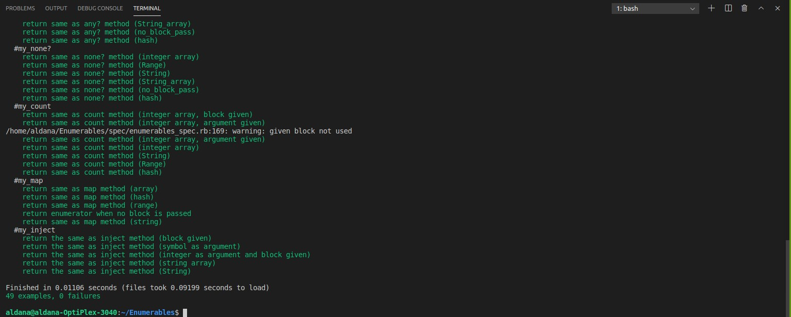

# Enumerables_Ruby

This project uses our methods for Enumerables in Ruby and test them using rspec.The methods created are:

- #my_each
- #my_each_with_index
- #my_select
- #my_all?
- #my_any?
- #my_none?
- #my_count
- #my_map
- #my_inject

## Built With

- RUBY

**Tested with**

- Rspec

**Lintered with**

- Rubocop

## Getting Started

**Prerequisites**

-Having [Ruby](https://www.ruby-lang.org/en/) installed in your machine.

### In case you have Rspec installed

To get a local copy of the repository please run the following commands on your terminal:

- $ git clone https://github.com/AlduLonghi/Enumerables
- cd into above cloned directory
- go to spec/enumerables_spec.rb
- run $ rspec
- check the output

### In case you don't have Rspec installed

- Open your terminal and run $ gem install rspec

Follow these steps: 

- $ git clone https://github.com/AlduLonghi/Enumerables
- cd into above cloned directory
- go to spec/enumerables_spec.rb
- run $ rspec
- check the output

## Authors

👤 **Aldana**
​

- Github: [@AlduLonghi](https://github.com/AlduLonghi)

- Twitter: [@AbrilLonghi](https://twitter.com/AbrilLonghi)

- Linkedin: [Aldana Abril Longhi](https://www.linkedin.com/in/aldana-abril-longhi-a842ba1a7/)

👤 **Razika**

- Github: [@rahalrazika](https://github.com/rahalrazika)

- Linkedin : [Razika Rahal](https://www.linkedin.com/in/razika-rahal-85539bbb/)

- Twitter: [@RereRere055](https://twitter.com/RereRere055)

## Contributing

Contributions, issues and feature requests are welcome!

## Show your support

Give a  if you like this project
